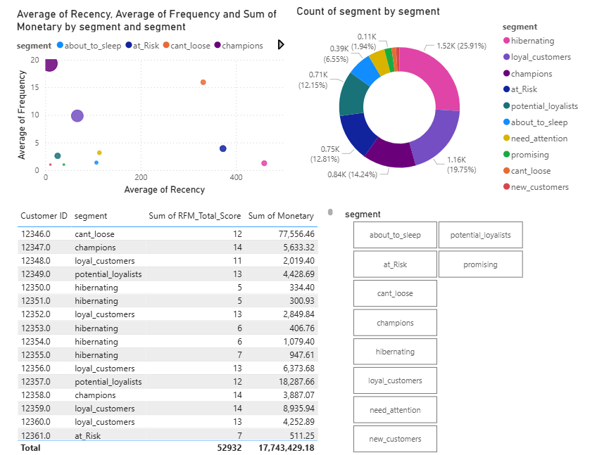

# Customer Segmentation using RFM Analysis

## Project Overview
This project performs an end-to-end Customer Segmentation analysis using the **RFM (Recency, Frequency, Monetary)** model. I used a dataset of 1 million+ transactions from a UK-based online retail store (2009-2011).

## Tech Stack
- **Python**: Data cleaning, processing and scoring (Pandas, OS).
- **Matplotlib & Squarify**: Visualizing segments with Treemaps.
- **Power BI**: Creating an interactive executive dashboard for business insights.

## Analysis Steps
1. **Data Cleaning**: Handled missing values, removed cancellations, and merged multi-year data.
2. **RFM Metrics**: Calculated Recency (days since last purchase), Frequency (total orders), and Monetary (total spend) for each customer.
3. **Scoring**: Assigned scores from 1-5 for each metric using quintiles.
4. **Segmentation**: Mapped customers to segments like *Champions*, *Loyal Customers*, *At Risk*, etc.

## Interactive Dashboard
Below is a preview of the interactive Power BI dashboard:

## How to use
- The Python scripts in `/scripts` generate the final scored dataset.
- The `/data` folder contains the processed CSV.